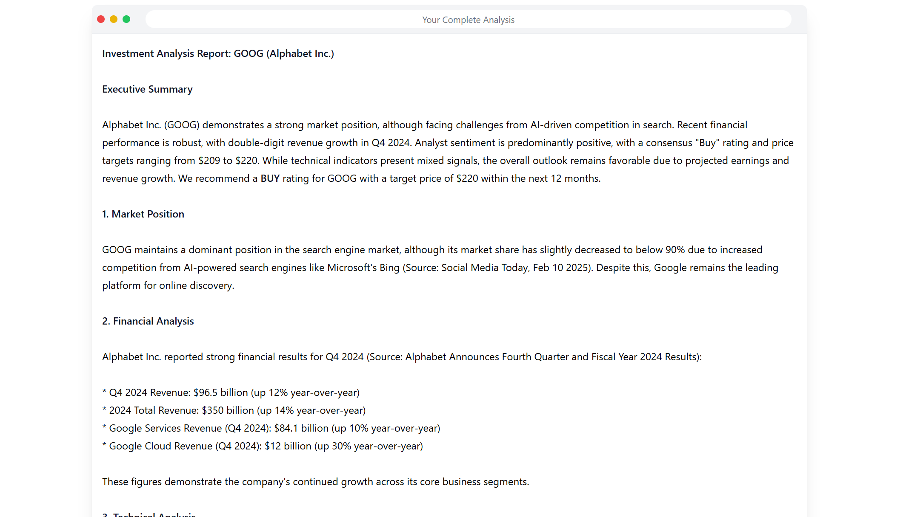

# QuantMosaic

<div align="center">
  
</div>

> 🚀 Analyze. Predict. Invest. With a little help from AI.
>
> A Multi-Agentic Crew to get the best Results!

[](https://www.crewai.com/)
[](https://www.langchain.com/)
[](https://gemini.google.com/)

## 📸 Screenshots

### Web Interface

#### Home Page


#### Analysis Dashboard


### Sample Reports

#### Analysis



## Overview

The system uses six specialized AI agents to analyze stocks:
- Data Collection Agent: Gathers financial metrics and market data
- Fundamental Analysis Agent: Evaluates company financials and valuation
- Technical Analysis Agent: Studies price patterns and indicators
- Sentiment Analysis Agent: Analyzes market sentiment and news
- Prediction Agent: Forecasts potential price movements
- Report Generation Agent: Synthesizes findings into actionable reports

## Prerequisites

- Python 3.9+
- Node.js 16+
- API Keys:
  - Google Gemini Pro
  - AlphaVantage
  - CrewAI (optional)

## Quick Start

1. **Set Environment Variables**
```bash
export GEMINI_API_KEY="your_gemini_key"
export ALPHAVANTAGE_API_KEY="your_alphavantage_key"
```

2. **Install Backend**
```bash
# Create virtual environment
python -m venv venv
source venv/bin/activate  # or `venv\Scripts\activate` on Windows

# Install dependencies
pip install -r requirements.txt
```

3. **Install Frontend**
```bash
npm install
```

4. **Run Application**
```bash
# Start backend
python main.py

# Start frontend (in a new terminal)
npm start
```

## System Architecture

### Backend Components

#### AI Agent System
- **CrewAI Framework**: Orchestrates agent interactions and task delegation
- **Agent Specialization**: Each agent focuses on specific analysis aspects
- **Data Flow**: Sequential processing with context sharing between agents

#### API Layer
- **Framework**: Flask with RESTful endpoints
- **Data Source**: AlphaVantage API integration
- **Processing**: Asynchronous task handling for long-running analyses

### Frontend Components

#### User Interface
- **Framework**: React with functional components
- **Charting**: TradingView integration for real-time data visualization
- **Styling**: Tailwind CSS with dark mode support

## API Documentation

### Analyze Stock
```http
POST /analyze
Content-Type: application/json

{
    "ticker": "AAPL"
}
```

**Success Response**
```json
{
    "report": "<markdown-formatted-analysis>",
    "message": "Analysis complete"
}
```

**Error Response**
```json
{
    "error": "Error message"
}
```

## Key Features

### Fundamental Analysis
- Financial ratio calculations
- Growth trend analysis
- Competitive position assessment
- Risk evaluation

### Technical Analysis
- Price pattern recognition
- Technical indicator computation
- Volume analysis
- Support/resistance identification

### Sentiment Analysis
- News sentiment evaluation
- Social media analysis
- Market sentiment quantification
- Trend identification

### Predictive Analysis
- Short-term price projections
- Medium-term market outlook
- Risk factor assessment
- Confidence metrics

## Error Handling

The system implements robust error handling:
- Input validation
- API error management
- Rate limit handling
- Graceful degradation

## Future Enhancements

Planned improvements:
- Portfolio analysis capabilities
- Real-time market alerts
- Custom analysis parameters
- Advanced visualization options
- Batch processing for multiple stocks

## Testing

Run the test suite:
```bash
# Backend tests
python -m pytest tests/

# Frontend tests
npm test
```

## Contributing

1. Fork the repository
2. Create a feature branch (`git checkout -b feature/AmazingFeature`)
3. Commit changes (`git commit -m 'Add AmazingFeature'`)
4. Push to branch (`git push origin feature/AmazingFeature`)
5. Open a Pull Request

## Support

For support:
- Open an issue
- Check documentation
- Contact development team

## License

MIT License - see LICENSE file for details.

## Disclaimer

This platform is for research purposes only. Always conduct independent analysis and consult financial advisors before making investment decisions. The system provides analysis based on available data but makes no guarantees about prediction accuracy.